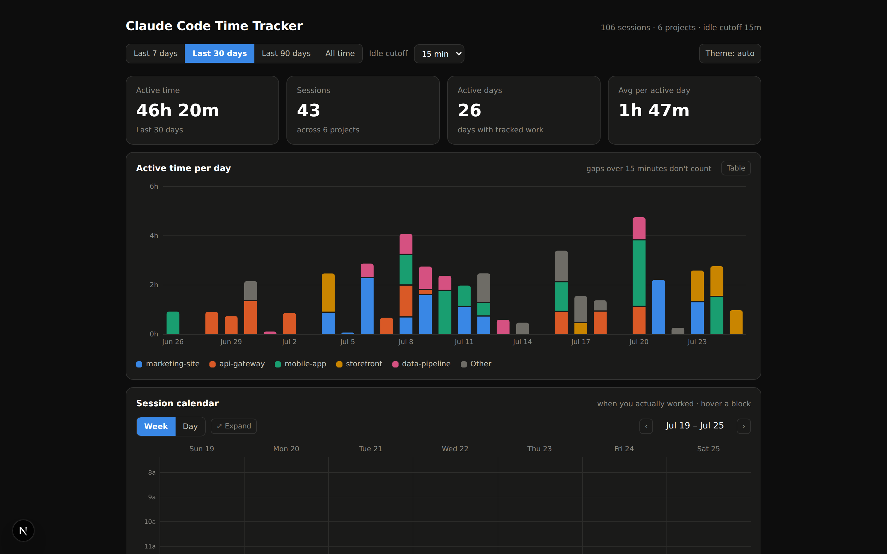
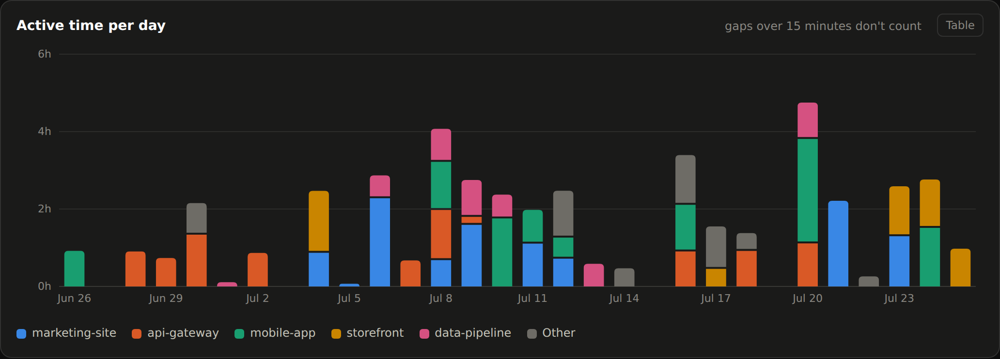
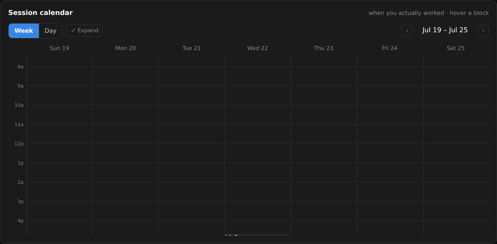
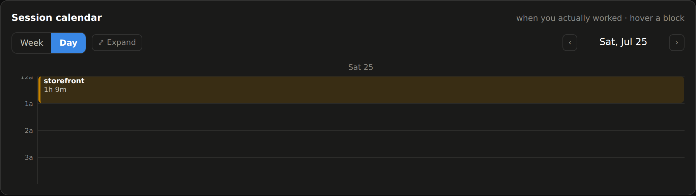
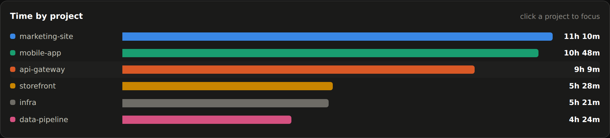
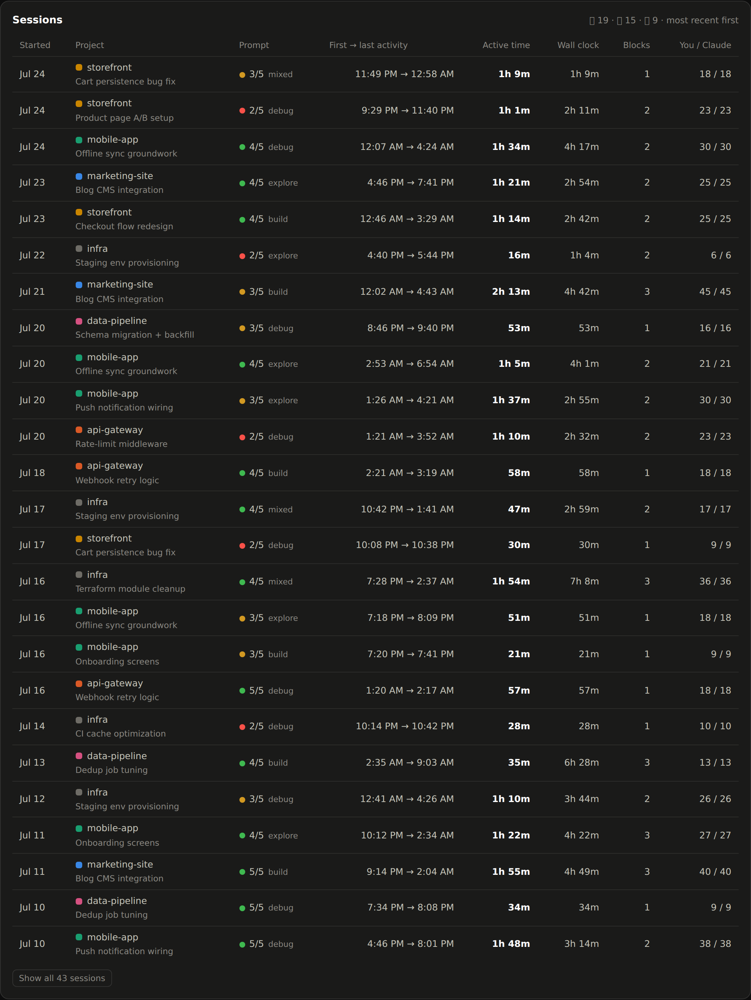
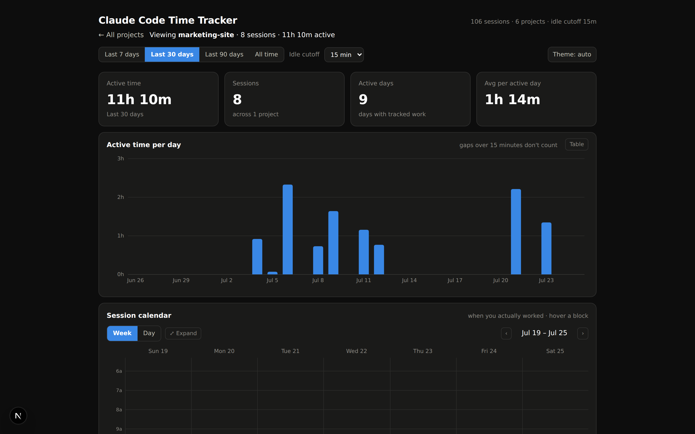
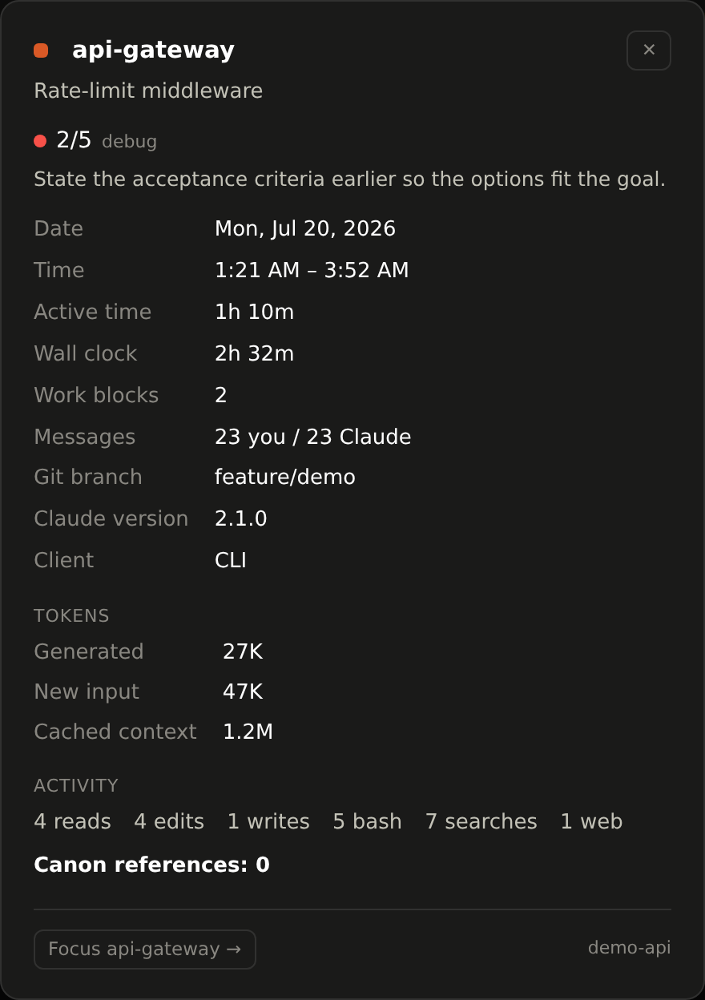

# Claude Code Time Tracker

**Idle-aware time tracking for [Claude Code](https://claude.com/claude-code) — see how long you and Claude actually worked, per project, per day, per session.**

Claude Code already writes a complete transcript of every session to `~/.claude/projects/<project>/<session>.jsonl`, with a timestamp on every message. This tool reads those logs and turns them into an honest, visual work report — active hours (not wall-clock), a calendar of when you actually worked, per-project drill-downs, per-session token and tool usage, and optional AI-graded prompt-health ratings.



> Screenshots use the bundled **demo dataset** (anonymized project names). Your real data never leaves your machine unless you deliberately publish it.

---

## Key features

**Honest active-time tracking**
- **Active time, not wall clock** — the clock runs while there's back-and-forth; any gap longer than the idle threshold splits the session into separate work blocks, so idle time doesn't count.
- **Configurable idle cutoff** — 5 min (billing-strict) · 15 min (default) · 30/60 min (research-tolerant), changed live in the filter row.
- **Per project · per day · per session** totals, with a stacked daily chart (and a table twin) and KPI tiles: active time, sessions, active days, avg per active day.
- **Date-range presets** — Last 7 / 30 / 90 days · All time.

**Session calendar** *(when you actually worked)*
- **Week or Day view**, toggled inline. Work blocks are laid out at the real hour they ran, color-coded by project, with overlap lane-packing.
- **Collapsible** to a 400px window (centered on your active hours, sticky day header) with an **Expand** button for the full grid, and prev/next navigation.
- **Hover** a block for details; **click** it to open the session modal.

**Per-project drill-down**
- Click any project (a bar, a session row, or a calendar block's "Focus") and the **whole dashboard scopes to that project**, with a breadcrumb back to all projects.

**Session detail modal**
- Title, date, time range, active vs wall clock, work-block count, message counts (you / Claude), git branch, Claude version.
- **Client provenance** — Desktop app vs CLI.
- **Token breakdown** — generated (output) · new input · cached context, summed per session (and per work block).
- **Activity trace** — reads · edits · writes · bash · searches · web.
- **Canon references** — an exact count of Canonify canon-doc reads (with a "consulted mid-build" sub-count).

**Prompt health** *(optional, LLM-assisted)*
- A per-session **🟢 / 🟡 / 🔴 rating + 1–5 score**, calibrated to the session type (explore · build · debug · mixed), with a one-line coaching note and a short auto-generated title.
- Runs locally via Claude Haiku; **only the rating and title are stored** — never your prompt text.

**Deploy & share**
- **Local** (`npm run dev`) reads your live `~/.claude` — always current, fully private.
- **Static snapshot** (`npm run snapshot`) — one self-contained HTML file with your data baked in.
- **Hosted on Vercel** behind a **passwordless magic-link login** (email allowlist), with real data pushed to private Vercel Blob storage and a public demo fallback.

---

## Feature tour

### The daily chart
Active time per day, stacked by project. Gaps over the idle cutoff don't count, and every chart has a table twin.



### Session calendar — week & day
See *when* you worked, not just how much. Blocks are the idle-split active periods, placed by their real start time.



Switch to **Day** for a single wide column:



### Time by project & the sessions table
Click a project to focus. Each session row shows its title, a prompt-health badge, and the core stats.





### Per-project drill-down
Everything — KPIs, chart, calendar, sessions — scoped to one project.



### Session detail
Click any calendar block for the full picture: tokens, activity trace, canon references, and the desktop-vs-CLI client.



---

## Quick start

```bash
git clone https://github.com/ewebdzine/claude-code-time-tracker
cd claude-code-time-tracker
npm install
npm run dev
```

Open http://localhost:3000. The dashboard reads `~/.claude` on the machine it runs on (override with the `CLAUDE_DIR` environment variable). It re-reads your logs on every request, so it's always current — nothing to refresh.

## How active time is computed

1. Every transcript line with a timestamp and a `user` / `assistant` / `system` type becomes an event.
2. Events in a session are grouped into **work blocks**: consecutive events stay in one block while the gap between them is ≤ the idle threshold.
3. A block's duration is `last event − first event`. Session active time is the sum of its blocks. A lone event (a session you opened and abandoned) counts as zero.
4. Day totals split midnight-crossing blocks across the days they touch, in your timezone.

The idle threshold is the honest-hours dial: 5 min approximates billing-strict tracking, 15 min (default) tolerates coffee, 30–60 min tolerates research detours.

## Token, tool & canon analytics

All computed deterministically from the logs — no LLM, and only numbers/labels are stored (never message content):

- **Tokens** per assistant turn (`message.usage`) are summed per work block and per session — generated output, fresh input, and cached-context reads.
- **Tool usage** is counted from `tool_use` blocks — reads, edits, writes, bash, searches, web.
- **Canon references** counts reads of Canonify canon docs, with a read-then-rework detector.
- **Client** is the session's `entrypoint` (`claude-desktop` → "Desktop app", `cli` → "CLI").

## Prompt-health scoring (optional)

```bash
ANTHROPIC_API_KEY=sk-ant-... npm run score-sessions -- --new
```

Rates how well you prompted each session using Claude Haiku and caches the result locally (`~/.cache/ccti/scores.json`). Your prompt text is read on your machine and sent only to the Anthropic API; **only the resulting rating and title** are attached to the report. `--new` scores un-rated sessions; `--all` re-scores everything.

## Static snapshots

Export a single self-contained HTML file — shareable, attachable, no server:

```bash
npm run snapshot -- --out my-hours.html --idle-minutes 15 --tz America/Los_Angeles
```

Options: `--idle-minutes <n>` · `--days <n>` · `--tz <IANA zone>` · `--claude-dir <path>` · `--report <path.json>`.

## Private hosted dashboard (magic link + your real data)

Want your real hours on a hosted URL, visible only to you?

- **Magic-link login** — set `AUTH_SECRET` + `ALLOWED_EMAILS`, and every route is gated behind a passwordless email link ([`middleware.ts`](middleware.ts)); only listed addresses can sign in. Links are sent via [Resend](https://resend.com) (`RESEND_API_KEY`). With auth unset (local dev), the gate is bypassed.
- **Real data via Vercel Blob** — the dev machine pushes its report with `npm run push-blob` (needs `BLOB_READ_WRITE_TOKEN`); the hosted API reads it server-side and serves it behind the login. Run it on a schedule (e.g. hourly cron) to keep it fresh. Your data never touches the repo.

Env vars are documented in [`.env.example`](.env.example). With neither Blob nor local logs present, the API serves the bundled demo dataset (regenerate with `npm run demo-data`).

## Tests

```bash
npm test
```

Covers block splitting (threshold edges, lone events), session summarization, range filters, and timezone-correct midnight splitting.

## Privacy

Your transcripts never leave your machine. The report is built from **timestamps, message types, token counts, and tool names only** — it never puts message content into the report. Prompt-health scoring reads your prompts locally and sends them only to the Anthropic API; only the rating and title come back. A snapshot or hosted deploy contains your project names, session times, message counts, tokens, and ratings — share accordingly.

## Project layout

```
lib/parser.ts     JSONL transcript parser — timestamps, tokens, tool usage, entrypoint
lib/blocks.ts     work-block engine: idle splitting, day bucketing, token/session aggregation
lib/view.ts       browser-safe view helpers (range filters, project scoping, colors, formatting)
lib/scores.ts     prompt-health score cache + attach
lib/auth.ts       magic-link auth (signed tokens, allowlist, Resend) — edge-safe
lib/blob.ts       read the pushed report from Vercel Blob (hosted deploys)
middleware.ts     gates every route behind the login when auth is configured
components/        the dashboard (React, no chart library — hand-rolled SVG)
app/login         email-a-link sign-in page
app/api/auth      request · callback · logout routes
app/api/data      scan endpoint (idleMinutes, days, tz) + Blob/demo fallback
scripts/          static snapshot · demo data · Blob push · prompt-health scorer
```

## License

MIT
